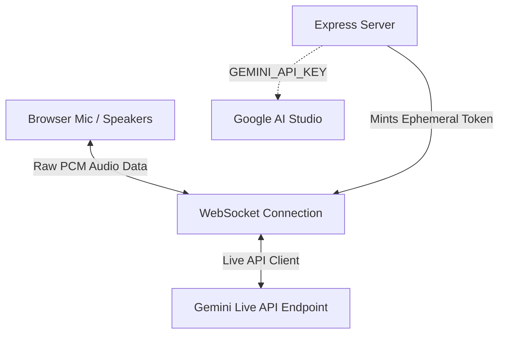

# Avery — Voice Travel Agent ✈️🗣️

Avery is a warm, real-time voice travel agent designed to help travelers plan flights, hotels, itineraries, packing lists, and budgets. Built as a high-performance **Single-Page Application (SPA)**, Avery utilizes the native bidirectionality of Google's **Gemini 3.1 Live API** (`gemini-3.1-flash-live-preview`) to deliver fluid, ultra-low latency, human-like voice interactions.

---

## 🌟 Key Features

*   **Real-time Conversational Voice**: Speech-to-speech interaction using Gemini 3.1 Live with native audio input/output (no intermediary text-to-speech delays).
*   **Active Locales & Currency Formatting**: Speak in English, Spanish, French, German, Hindi, Japanese, or Portuguese. All prices, night rates, and flight costs are automatically converted to your local currency (USD, EUR, INR, JPY, BRL) using real-time mock conversion rates.
*   **Deterministic Search Tools**: Runs local flight and hotel search tools via function calling.
    *   `search_flights`: Finds mock schedules, airlines, stops, and prices for routes (e.g. NYC to Tokyo).
    *   `search_hotels`: Finds nearby places to stay, ratings, distance, and perks.
*   **Rich Design Language**: Mint-green glassmorphism dashboard styling featuring glowing status orbs, responsive layouts, expandable result cards, and dynamic scroll logs.
*   **Session Token Minting**: A secure Express backend that creates short-lived session tokens, locking safety guardrails and system instructions server-side (preventing client-side API key exposure).
*   **Fully Bundled Frontend**: Relies on a compiled `esbuild` production bundle. Zero third-party script CDN dependencies for instant page loads.

---

## 🛠️ Architecture



*   **Client**: Vanilla HTML5, CSS Custom Properties, and ES Module Javascript compiled into `public/bundle.js`.
*   **Server**: Express backend serving static client files and hosting the `/api/token` route.

---

## 🚀 Getting Started

### 1. Prerequisites

Make sure you have [Node.js](https://nodejs.org/) (v20 or higher) installed.

### 2. Installation

Clone the repository and install the dependencies:

```bash
npm install
```

### 3. Environment Setup

Create a `.env` file in the root directory and add your Gemini API Key:

```bash
GEMINI_API_KEY=your_gemini_api_key_here
PORT=3000
```

*(Note: `.env` is ignored by git to protect your keys)*

### 4. Build Client Bundle

Compile the client-side dependencies:

```bash
npm run build
```

### 5. Start the Server

Run the development server:

```bash
npm start
```

Open [http://localhost:3000](http://localhost:3000) in your browser, allow microphone access, click the mic, and start talking to Avery!

---

## 📂 Project Structure

```
├── public/                 # Static frontend assets
│   ├── bundle.js           # Compiled esbuild production module
│   ├── app.js              # Raw client logic (Audio recording/playback, WS handlers)
│   ├── index.html          # Main application page
│   ├── style.css           # UI layout and styling
│   └── travel-doodles.jpg  # Masked background artwork
├── server.js               # Node/Express server and token-minting logic
├── package.json            # Scripts and dependencies
└── .env                    # Local secrets (ignored by git)
```

---

## 🤝 Persona & Guardrails

Avery is locked into a strict helpful persona server-side:
*   Avery will decline off-topic requests (code writing, math homework, recipes) warmly and guide the user back to travel topics.
*   Conversational tone is kept natural, short, and spoken-sounding.
*   Currencies are dynamically translated in real-time, enforcing the chosen local currency throughout the turn.
